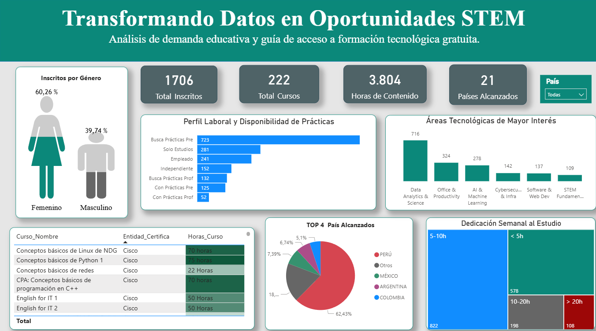

# 🚀 Unlocking STEM Opportunities with Data

> **"Dominar la tecnología no es la meta, es el puente para que cada estudiante convierta sus sueños en realidad. En este proyecto, transformamos datos en oportunidades; porque los números nos marcan la ruta, pero el análisis con propósito es lo que realmente nos da el impulso para romper brechas."**

---

### 📝 Resumen del Proyecto
Este ecosistema automatizado gestiona el ciclo de vida de **más de 1,700 postulantes** a formación tecnológica. No es solo un tablero de control; es una herramienta diseñada para **convertir datos en oportunidades**, permitiendo identificar perfiles de alto potencial y escalar la oferta educativa de manera eficiente y humana.

---

## 📊 Vista Previa del Dashboard Interactivo

### 💡 Insights de Impacto Real
* **Liderazgo Femenino:** El **59.65%** de los inscritos son mujeres listas para conquistar el mundo STEM.
* **Compromiso con el Futuro:** Se identificó que **822 personas** dedican entre 5 a 10 horas semanales a su formación técnica.
* **Eficiencia Cloud:** Gracias a la automatización con **Google Apps Script**, logramos una reducción del **90%** en la carga operativa de registro.

---

### 🛠️ Arquitectura del Pipeline (End-to-End)
Para lograr este impacto, construí un sistema basado en 4 pilares:
1. **Ingeniería de Datos (RPA & Python):** Extracción masiva y limpieza profunda de registros.
2. **Automatización Cloud:** Flujo en **Google Apps Script** para envío inmediato de recursos educativos al momento del registro.
3. **Integración en la Nube:** Conexión de datos en tiempo real para mantener los indicadores siempre actualizados.
4. **Business Intelligence:** Storytelling con datos en **Power BI** para la toma de decisiones estratégicas.

---

### 🚀 ¡PRUÉBALO EN VIVO!
GitHub solo permite imágenes estáticas, pero he desplegado la versión interactiva y actualizada con los **más de 1,700 registros** para que puedas filtrar y explorar los datos tú mismo:

👉 [**CLIC AQUÍ PARA INTERACTUAR CON EL DASHBOARD (GOOGLE SITES)**](https://sites.google.com/view/milagrosespinozacunya/dashboards)

---

### 📊 Ficha Técnica
* **Rol:** Data Analyst & Cloud Solutions Architect.
* **Herramientas:** Power BI (DAX), Python (Colab), RPA (Power Automate), Google Apps Script.
* **Impacto:** +1,700 registros procesados de 21 países.
